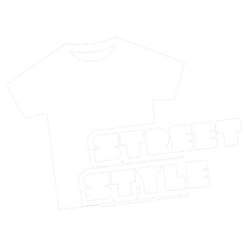
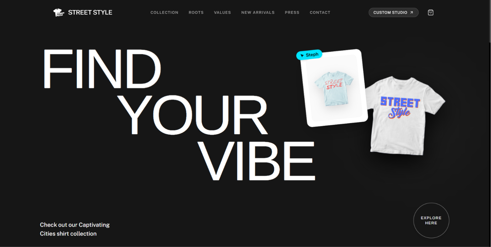
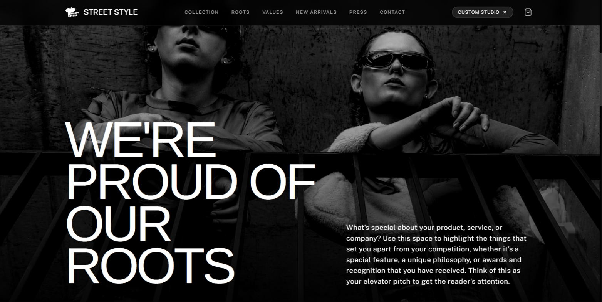
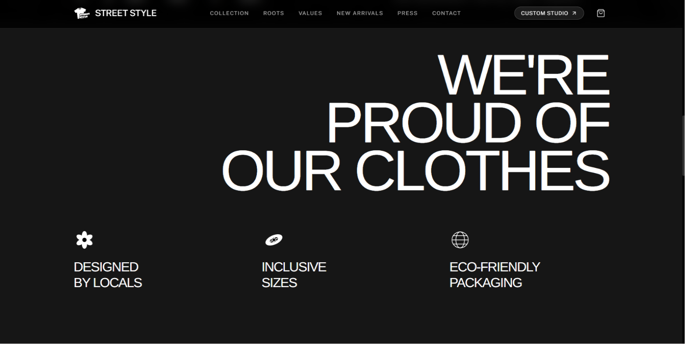
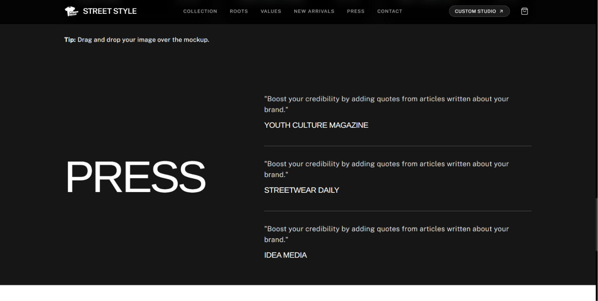
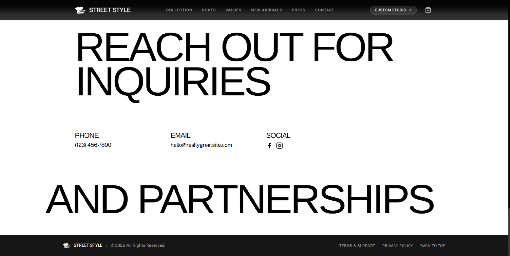

<div align="center">

  

  # ✦✦ STREET STYLE ✦✦
  ### Minimal Luxury Streetwear Landing Page & Interactive Print Studio

  [](https://react.dev/)
  [](https://vitejs.dev/)
  [](https://tailwindcss.com/)
  [](https://www.framer.com/motion/)
  [](LICENSE)

  <p align="center">
    A high-end, editorial fashion landing page featuring fluid typography, dark-mode luxury aesthetics, live interactive custom shirt design studio, and seamless shopping experience.
  </p>

  [Explore Features](#-key-features) • [Visual Showcase](#-visual-showcase) • [Quick Start](#-quick-start) • [Tech Stack](#%EF%B8%8F-tech-stack)

</div>

---

## 📸 Visual Showcase

<div align="center">

| **01. Hero Section** | **02. Editorial Story & Roots** |
| :---: | :---: |
|  |  |

| **03. Brand Values** | **04. New Arrivals Collection** |
| :---: | :---: |
|  |  |

| **05. Press Section** | **06. Contact & Partnerships** |
| :---: | :---: |
|  |  |

</div>

---

## ✨ Key Features

- 🖤 **Minimal Luxury Streetwear Design System**: Ultra-sleek dark palette (`rgb(22,22,22)` / `#161616`) contrasting with pure white editorial partnership layouts.
- 🎨 **Interactive Live Graphic Print Studio**: Upload custom artwork, logos, or patterns to dynamically render and position them on t-shirt mockups in real time.
- 🛍️ **Slide-Over Shopping Bag Drawer**: Instant cart management with size selection (`S`, `M`, `L`, `XL`, `2XL`), quantity toggles, live subtotal calculations, and checkout simulation.
- 📖 **Editorial Press & Brand Values**: Interactive thin-line hover accordion lists, press quotes, and custom SVG icon showcases.
- 📐 **Fluid Clamped Typography**: Micro-tuned `text-[clamp(...)]` system ensuring oversized headings scale seamlessly across mobile devices and ultra-wide displays.
- ⚡ **Optimized Performance**: Zero build warnings, fast Hot Module Replacement (HMR) with Vite 6, and production chunk optimization.

---

## 🛠️ Tech Stack

```text
├── Framework        : React 18.3 (Component-Driven Architecture)
├── Build Tool       : Vite 6.1 (Ultra-fast HMR & Production Bundler)
├── Styling          : Tailwind CSS 3.4 (Custom Typography Clamps & Utilities)
├── Animations       : Framer Motion 11.18 (Scroll-Triggered Micro-Interactions)
├── Icons            : Lucide React (Minimal Vector Icons)
└── Typography       : Google Fonts (Arimo Display & Public Sans)
```

---

## 🚀 Quick Start

Follow these steps to run the repository locally on your machine:

### 1. Clone the repository
```bash
git clone https://github.com/aryankumar-04/Street-Style.git
cd Street-Style
```

### 2. Install dependencies
```bash
npm install
```

### 3. Start development server
```bash
npm run dev
```
Open **`http://localhost:3000`** in your browser to view the application live.

---

## 📦 Production Build

To test or build the optimized production bundle:

```bash
# Generate production bundle in dist/
npm run build

# Preview production build locally
npm run preview
```

---

## 📂 Repository Architecture

```text
Street-Style/
├── asset/images/           # High-resolution image assets & design previews
│   ├── logo.png            # Main brand t-shirt logo
│   ├── logo.ico            # Favicon icon
│   ├── cover.png           # Editorial roots section background
│   └── 1.png - 6.png       # Section design showcase images
├── public/                 # Static public assets
│   ├── logo.png
│   └── favicon.ico
├── src/
│   ├── components/         # Modular React Components
│   │   ├── Header.jsx              # Fixed header navigation with logo
│   │   ├── HeroSection.jsx         # Oversized hero typography & Y2K card
│   │   ├── RootsSection.jsx        # Editorial brand story section
│   │   ├── ValuesSection.jsx       # Brand values & custom icons
│   │   ├── NewArrivalsSection.jsx  # Interactive product grid
│   │   ├── PressSection.jsx        # Thin-divider press quotes list
│   │   ├── ContactSection.jsx      # Partnerships & contact details grid
│   │   ├── ProductModal.jsx        # Quick-view product modal
│   │   ├── CustomizerModal.jsx     # Live graphic print studio
│   │   ├── CartDrawer.jsx          # Slide-over shopping bag drawer
│   │   ├── InquiryModal.jsx        # Partnership inquiry modal
│   │   └── Footer.jsx              # Minimalist bottom footer bar
│   ├── data/
│   │   └── contentData.js  # Centralized editable site copy & product database
│   ├── App.jsx             # Root application component & global state
│   ├── index.css           # Tailwind CSS base directives & global styles
│   └── main.jsx            # React DOM entry point
├── index.html              # HTML document template & Google Fonts link
├── package.json            # Node dependencies & build scripts
├── tailwind.config.js      # Custom fonts & layout theme extensions
└── vite.config.js          # Vite build config
```

---

## 👤 Author

Developed with ❤️ by **[Aryan Kumar](https://github.com/aryankumar-04)**

- 🌐 **Live Demo:** https://street-style-zhq1.onrender.com/
- 💻 **GitHub:** [@aryankumar-04](https://github.com/aryankumar-04)
- 📦 **Repository:** [aryankumar-04/Street-Style](https://github.com/aryankumar-04/Street-Style)

---

## 📄 License

This project is open-source and available under the **[MIT License](LICENSE)**.
